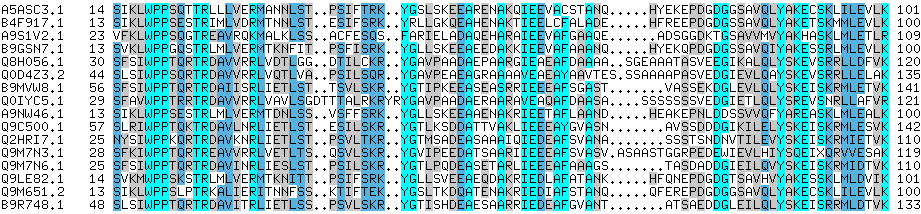

---
format:
  revealjs:
    theme: default
    slide-number: true
    transition: slide
    overview: true
    chalkboard: true
    navigation-mode: linear
    center: false
    auto-stretch: true
    css: styles.css
---

```{=html}
<div class="title-slide-container">
  <div class="title-header">
    
    <div class="eurocall-title-text">EuroCALL 2026 | Belfast</div>
  </div>

  <div class="title-main-block">
    <h1 class="title-heading">Visualizing the DNA of Discourse</h1>
    <h3 class="title-subheading">Sequencing Rhetorical Moves and Steps in Python</h3>
    <div class="title-author-text">Charles Lam, University of Leeds</div>
  </div>

  <div class="title-footer">
    
  </div>
</div>
```

---

## Overview

- The Pedagogical Challenge: Making academic discourse explicit
- Solution: Visualizing the Move-Step Analysis
- **MoveStepViz** 
  - Visualization tool inspired by Multiple Sequence Alignment (MSA) in bioinformatics
  - Decoding and displaying rhetorical structure at a glance
- Implications: 
  - Data-driven learning (DDL) for genre knowledge 
  - Potentials with genre analysis with AI-annotation
  

# The Pedagogical Challenge {background-color="#cbd5e1"}
                                                                                                                                                                                
## Why Novice Writers Struggle with Genre?

Novice and L2 academic writers often struggle to replicate the rhetorical expectations of research genres.

- Students know they need to "provide background," but miss **how** it is done and what counts as appropriate presentation of background in academic writing
- Rhetorical moves are often **implicit** and the ordering can be discipline-specific.
- Explicit instruction and demonstration have been shown to benefit rhetorical strategies (Flowerdew 2000; Cheng 2007; 2008)
- Limited exposure to discourse / narrative in STEM disciplines

## What is Move-Step Analysis?

::: {.columns}
::: {.column width="45%"}
::: {.callout-note}
### Swalesian CARS Model (1990; 2004)

* **Move 1: Establishing a territory**
  * *Step 1*: Claiming centrality
  * *Step 2*: Making topic generalizations
  * *Step 3*: Reviewing previous research
* **Move 2: Establishing a niche**
  * *Step 1*: Counter-claiming
  * *Step 2*: Indicating a gap
  * *Step 3*: Question-raising
  * *Step 4*: Continuing a tradition
* **Move 3: Occupying the niche**
  * *Step 1a*: Outlining purposes 
  * *Step 1b*: Announcing present research
  * *Step 2*: Announcing principal findings
  * *Step 3*: Indicating research article structure
:::
:::

::: {.column width="55%"}
### Sample Steps in Introduction

"In recent years, AI-assisted language learning has attracted widespread attention in applied linguistics. **[Step 1]**

Novice researchers often find mastering academic genre conventions challenging. **[Step 2]**

Previous studies (e.g., Swales, 1990; Cotos et al., 2017) have highlighted the role of rhetorical move patterns. **[Step 3]**" 

* **M1-Step 1: Claiming centrality**\
* **M1-Step 2: Topic generalization**\
* **M1-Step 3: Reviewing previous research**\

    ::: {style font-color="#cbd5e6"}
    By labelling the Moves and Steps, researchers have the tools to investigate (i) how these typical components are ordered and (ii) how they are realized in language. 
    :::
:::
:::


# Visualization with Cross-Disciplinary Inspiration {background-color="#cbd5e1"}

## The "DNA of Discourse" Metaphor

:::: {.columns}
::: {.column width="50%"}
### Multiple Sequence Alignment (MSA) in Bioinformatics
{width="95%"}

* Aligns DNA/RNA/amino acid sequences into color-coded blocks.
* Reveals patterns, mutations, and conservation across organisms, by comparing rows. 
:::

::: {.column width="50%"}
### Discourse & Linguistics

* Like organisms, texts contain basic components that often display a **normal**, **typical** order. 
* By visualizing the pattern, users can compare similarity and diversity. 

::: {.callout-note}
### The Pedagogical Parallel
**Multiple Sequence Alignment** in biology translates directly to **Rhetorical Sequence Alignment** in language education:
:::

:::
::::

# Introducing MoveStepViz {background-color="#cbd5e1"}

## MoveStepViz

A pedagogical visualization toolkit designed for language educators, students, and corpus linguists.

::: {.columns}
::: {.column width="50%"}
### Python Package (`movestepviz` v0.2.3)
* Open-source on PyPI
* Generates publication-ready DNA-strip diagrams.
* Pre-loaded with frequently-used rhetorical schemes (CARS, DRaC).
* Fully customizable colours, labels, and layouts.
:::

::: {.column width="50%"}
### Web Interface
* User-friendly interface for teachers and students
* Interactive exploration
* Drag-and-drop custom annotation upload
:::
:::

---

## Anatomy of Rhetorical Moves and Steps 

Similar to a DNA sequence, a row represents a unit containing foundamental elements:  

::: {style="text-align: center;"}
{width="65%"}
:::

* Each Move has a distinct color (Green = M1, Red = M2, etc.)
* Steps within the same move share shades of the family for intuitive hierarchy
* Readable In-Cell Labels (e.g. `M1-S1`, `M1-S2`, `M2-S1`, `M3-S1`)


::: {.fragment}
**This provides users an overview of the progression of moves, while keeping track of the exact steps used.**

- Some steps repeat 
- Some steps are optional
:::

## Pre-loaded Genre & Section Schemes

| Scheme | Research Article Section | Foundational Research |
| :--- | :--- | :--- |
| **`Swales2004`** | **Introduction** (CARS model) | Swales (1990, 2004) |
| **`Cotos_etal2017`** | **Methods** (DRaC model) | Cotos, Huffman, & Link (2017) |
| **`Yang_Allison2003_Results`** | **Results** | Yang & Allison (2003) |
| **`Yang_Allison2003_Discussion`** | **Discussion** | Yang & Allison (2003) |

| **Custom Schemes** | Any user-defined annotation scheme in CSV or JSON |

## More Customization

::: {.columns}
  ::: {.column width="40%"}
  * Export of figure in various formats (JPG, PNG, SVG) 
  * Display and labelling options (`M1-S3` vs. `1c` vs. `1.3`)
  * Custom colour palette to highlight particular moves/steps
  * Basic statistics of steps (# of texts, # of steps, # of unique steps) 
  :::

  ::: {.column width="60%"}
  {width="65%"}
  :::
:::

# Web-based Graphical User Interface {background-color="#cbd5e1"}

## More Intuitive Input to MoveStepViz {background-iframe="https://charles-lam.net/movestepviz/" background-interactive="true"}
iframe="https://charles-lam.net/movestepviz/" background-interactive="true"}

<!-- [charles-lam.net/movestepviz](charles-lam.net/movestepviz) -->


<!-- 
::: {.columns}
::: {.column width="60%"}


:::


::: {.column width="40%"}

**add figure**
:::

:::
 -->


# Pedagogical Applications in CALL {background-color="#cbd5e1"}

## 1. Data-Driven Learning (DDL) & Discovery {background-color="#d78aefff"}

:::: {.columns}
::: {.column width="60%"}
### Moving from Rule-Memorizing to Pattern Discovery
* Students explore reference corpora of published articles in their target discipline.
* Visualizing multiple articles simultaneously reveals **genre flexibility** (e.g. cyclical move patterns vs. linear progressions).
* Learners notice that Move 2 (Gap) frequently recurs before subsequent sub-aims.
:::

::: {.column width="40%"}
::: {.callout-tip}
### In the Classroom
Ask students: *"Look at these 10 published introductions. Do all authors follow 1a $\rightarrow$ 1b $\rightarrow$ 2a $\rightarrow$ 3a, or where do they diverge?"*
:::
:::
::::

---

## 2. Comparative Feedback (Novice vs. Expert) {background-color="#d78aefff"}

::: {.columns}
::: {.column width="50%"}
### Student Draft (Novice)
* Long green chains (**Move 1: Literature**) without ever establishing a research gap (**Move 2**).
* Sudden jump to **Move 3** without justifying the contribution.
:::

::: {.column width="50%"}
### Target Model (Published)
* Balanced sequence: Territory $\rightarrow$ Topic generalizations $\rightarrow$ Explicit Gap $\rightarrow$ Clear contribution.
:::
:::

::: {.callout-note}
### Actionable Visual Feedback
Instead of saying *"your introduction lacks focus"*, teachers point to the missing color block: *"Notice there is no red block (Move 2: Gap) between your green literature review and blue purpose statement."*
:::

---

## 3. Interactive Move-Step Analysis Visualizer {background-color="#cfd1cbff"}

### Tool for demonstration and exploration

<https://github.com/charlestklam/movestepviz/>


## 4. Why the Python package when you have the web-interface? 

::: {.columns}
  ::: {.column width="50%"}
  ### Automation
  - 
  - 
  - 
  :::

  ::: {.column width="50%"}
  ### GenAI Integration
  - The 
  - A `skills.md` file is created for AI agents to connect with 
  - **Next step:** (Semi-)Automated annotation!
  :::
:::
 


## 4. Student Self-Assessment & Peer Review {background-color="#fefeffff"}

::: {.columns}
::: {.column width="33%"}
### 1. Annotate
Students tag their own sentences using simple drop-down menus or step labels.
:::

::: {.column width="33%"}
### 2. Visualize
Generate the DNA strip of their draft with one click in the web app.
:::

::: {.column width="33%"}
### 3. Diagnose
Visually inspect structural flow, missing steps, or disjointed move transitions before submission.
:::
:::

::: {.fragment}
> **Linguistic Inclusion**: Demystifies implicit academic conventions for international and multilingual scholars who may not share Anglophone genre expectations.
:::

---

# Teacher-Friendly Workflows {background-color="#d78aefff"}

## Intuitive Data Input for Educators

Teachers and students can organize datasets in two intuitive formats:

::: {.columns}
::: {.column width="50%"}
### Wide Format (1 Row per Article)
* Perfect for overviewing a whole classroom corpus at a glance.
```csv
article_id,step_1,step_2,step_3,step_4
Student_A,M1-S1,M1-S2,M2-S1,M3-S1
Student_B,M1-S1,M1-S3,M1-S2,M3-S1
Expert_01,M1-S1,M1-S3,M2-S1B,M3-S1A
```
:::

::: {.column width="50%"}
### Long Format (Sentence-by-Sentence)
* Ideal when attaching actual sentence text for concordance study.
```csv
sentence_id,label,text
1,M1-S1,Discourse analysis is vital...
2,M1-S2,Recent studies focus on...
3,M2-S1B,However, visualization is...
4,M3-S1A,This paper introduces...
```
:::
:::

---

## Effortless Python & CLI Integration

For researchers and CALL developers, one line generates the visual:

```python
import movestepviz as msv

# 1-Line Generation: Reads files or Python lists
msv.visualize(
    data="classroom_corpus.csv",
    scheme="Swales2004",
    title="Research Introduction: Rhetorical Progression",
    labelling_scheme="number-letter",  # Formats as 1a, 1b, 2a, 3a
    output="rhetorical_dna.png"
)
```

::: {.callout-tip}
### Web-First Option
Language teachers without Python installed can achieve the identical output through the **interactive web tool**.
:::

---

# AI-Assisted CALL Tool Development {background-color="#d78aefff"}

## A New Paradigm for Language Teachers

How domain experts can create bespoke digital humanities tools in the GenAI era:

```
┌─────────────────────────────────┐       ┌─────────────────────────────────┐
│   Applied Linguist / Teacher    │       │        GenAI Coding Agents      │
│                                 │       │                                 │
│  • Pedagogical Goal Definition  │ ────► │  • Rapid Prototyping & Builds   │
│  • Genre Framework Expertise    │       │  • Python / Matplotlib Engine   │
│  • Classroom User Requirements  │ ◄──── │  • Packaging & Web Interface    │
└─────────────────────────────────┘       └─────────────────────────────────┘
```

::: {.incremental}
* **Lowering Technical Thresholds**: Linguists no longer need extensive software engineering backgrounds to build robust CALL software.
* **Pedagogy Leads Technology**: Teaching requirements drive the architecture, while AI handles technical implementation.
:::

## Potential Use beyond Genre Knowledge 

* Narrative structure & progression 


* Interactions and turn-taking 


# Summary & Takeaways {background-color="#cbd5e1"}

1. **Making Rhetoric Moves-Step Analysis Visible**: MoveStepViz transforms abstract genre concepts into tangible, visual DNA strips.
2. **Flexible Adoption**: Supports both a zero-code web interface and a lightweight Python package `movestepviz` (in conjunction with GenAI) 
3. **Empowering CALL Educators**: Demonstrates how language specialists can build and deploy bespoke tools for their classroom needs.

## Thank You! Questions and Comments Are Welcome!

::: {.columns}
::: {.column width="55%"}
::: {style="font-size: 0.8em;"}

**References**

  Cheng, A. (2007). Transferring generic features and recontextualizing genre awareness: Understanding writing performance in the ESP genre-based literacy framework. *English for specific purposes, 26*(3), 287-307.

  Cheng, A. (2008). Analyzing genre exemplars in preparation for writing: The case of an L2 graduate student in the ESP genre-based instructional framework of academic literacy. *Applied linguistics, 29*(1), 50-71.

  Cotos, E., Huffman, T., & Link, S. (2017). *Research article abstracts as genre-specific texts: The generic-specific analysis (GSA)*. English for Specific Purposes, 46, 50-63. 

  Dudley-Evans, T., & St John, M. J. (1998). *Developments in English for specific purposes: A cross-curricular approach*. Cambridge University Press. 

  Flowerdew, L. (2000). Using a genre-based framework to teach organizational structure in academic writing. *ELT journal, 54*(4), 369-378.

  Swales, J. M. (1990). *Genre analysis: English in academic and research settings*. Cambridge University Press. 

  Swales, J. M. (2004). *Research genres: Explorations and applications*. Cambridge University Press. 

  Yang, R., & Allison, D. (2003). *Research articles in abstracts: Structure, patterns of move-step organization, and their pedagogical implications for ESP*. English for Specific Purposes, 22(2), 127-148. 
:::
:::

::: {.column width="45%"}
### Project Resources
* **Web App & Slides**: [charles-lam.net/presentations/eurocall2026](https://charles-lam.net/presentations/eurocall2026/)
* **PyPI Package**: `pip install movestepviz` 
* **Package Documentation**: [pypi.org/project/movestepviz/](https://pypi.org/project/movestepviz/)
:::
:::